# THE PINK SILK

For my Project Portifolio #5 on Code Institute's Diploma in Software Developement course I have created an E-commerce store for a SPA called The Pink Silk. 

The website was designed in to be multi-page user friendly. Designed to offer people an easy way to buy a calm day off or just a few minutes of relaxation.

Being a new or a frequent visitor to the Spa, everyone can have access to the website, to view and purchase availeble packages. Website users have the option of register themselves and create a profile page, where is possible to edit their personal information and view previous orders. Once registered we encourage our visitors to leave a testimonial, to tell other users about their experience at the Spa. These testimonials can be commented for all users on the website. The shopping bag is easy to access by clicking on the bag icon on the top left of the page. There, users can find information about their current purchase. When clicking on 'Secure Checkout' the user is redirected to the checkout page, where the purchase can be securely finished.

A contact form is also available and, when submitted, one of our member staff will responde any questions related with our services. There is also a phone number and email availables on the bottom of every page if the user prefer contact us this way. We also have a subscription option so the user can have access to our weekly newsletter and be the first to know about offers when available. The address and a google map can be used to facilitate the navigation when going to the spa.

You can check the store page clicking [HERE](https://the-pink-silk.herokuapp.com/)

# User Experience UX

## Site Goals

### Site Owner's Goals

* Selling spa packages to all users.
* Providing detailed information about what is being offered on each package.
* Offering a simple and secure checkout.
* Letting users leave their personal opnion on treatments received at the spa.

### Site User's Goals

* Finding information about the services offered.
* Benefitting from other user's testimonials to help on making decisions.
* Learning more about the company and it's policies.

## Agile Planning

The project was developed using agile methodologies, by delivering small features divided in 4 sprints - To do Admin, To do User, In progress, Done.

Every card was labeled under User Story, divided in User and Admin. There is also a label for Bug, used when some issue was found.

The board was created  using Github projects and can be located [HERE](https://github.com/users/rlorimier/projects/1/views/1) to have access to more information on the project cards.

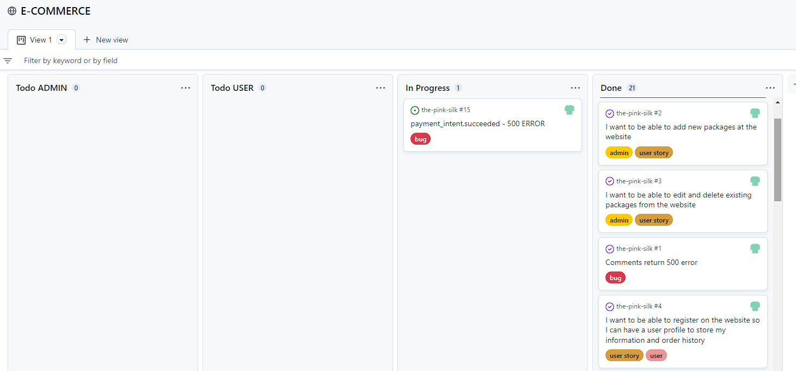

## User Stories

### As User:

* I want to see all packages available so I can decide what to buy.
* I want to see reviews so I can decide if this is the right place for me.
* I want to contact the Spa so I can have my queries answered.
* I want to be able to register so I can have my own account.
* I want to know more about the Spa and it's cancelation policy so I can make sure is a reliable place.
* I want to have a shopping bag so I can see what I am purchasing.
* I want to be able to update or delete items from my shopping bag so I can finish my purchase correctly.

### As Registered User:

* I want to write a testimonial so other users and the admin can read my opnion.
* I want to be able to login/out with no issues so I can have access to my profile.
* I want to have a personal profile so I can store my information and see previous orders made.

### As Admin:

* I want to add new packages for sale so I can increase the options available.
* I want to be able to edit existing packages so I can keep it updated. 
* I want to be able to delete existing packages so I can remove it if unavailable.

## The Scope

* Responsive design - site is fully functions on all screen sizes
* Navigation menu on all pages - Member Area changes depending on user status
* User authentication (register, login, logout)
* Hamburger menu for screens smaller than 994px
* CRUD functionality for admin users on packages
* List of packages and easy access to details page
* User profile, containing personal information and order history
* 404 error page

## Features

### User features

#### USER STORY

*As an user I want to see all packages available so I can decide what to buy*

*As an user I want to be able to register so I can have my own account*

*As an user I want to be able to login/out with no issues so I can have access to my profile*

*As an user I want to have a personal profile so I can store my information and see previous orders made*

* NAVBAR
  * Home - on the navigation bar at the top right, brings the user back to the home page.
  * Spa Packages - on the navigation bar at the top right, brings the user to a page containing a brief information about the available packages.
  * Testimonials - on the navigation bar at the top right, brings the user to a page where a list with all testimonials can be seen.
  * Contact - on the navigation bar at the top right, brings the user to a page containg a contact form.
  * Member Area - on the navigation bar at the top right:
    * All users have options to Register or Sign In
    * Registerd users have options to Sign Out, leave a New Testimonial or visit My Profile
    * Superusers have the same options as Registered users plus an option to Add New Package
  * Shopping Bag - on the navigation bar at the top right, brings the user to the shopping bag page.

  

#### USER STORY

*As an user I want to contact the Spa so I can have my queries answered*

* CONTACT FORM
  * All users can file the contact form.

  

* FOOTER
  * Get In Touch - column that provides the user the email and phone number of the Spa and also shows the openning times.
  * Subscribe - column where the user can subscribe for the Spa newsletter and also find a link to the Privacy Policy.
  * Find Us - column that shows the address and a map to the Spa location and also links to Social Media.
  
  

#### USER STORY

*As an user I want to know more about the Spa and it's cancelation policy so I can make sure is a reliable place*

* DISCOVER
  * By clicking on the Discover button at the Home page, the user is redirected to a page containg more information about the Spa, such as Cancellation Policy, Privacy and Terms and Conditions.

  

  

#### USER STORY

*As an user I want to have a shopping bag so I can see what I am purchasing*

*As an user I want to be able to update or delete items from my shopping bag so I can finish my purchase correctly*

* SHOPPING BAG
  * Where the user can see the packages seleted for purchase.
  * Is possible to adjust the quantity by typing a number in the box or using the arrows and then clicking on Update.
  * To remove thepackage from the bag, just click on the Remove buttom.
  * For purchase, click on Secure Checkout.
  * To add more items, click on Back to Packages.

  

#### USER STORY

*As an user I want to write a testimonial so other users and the admin can read my opnion*

*As an user I want to see reviews so I can decide if this is the right place for me*

* TESTIMONIALS
  * All users can read and leave comments on the testimonials.
  * Registered users can write new testimonials.

  

#### USER STORY

*As an admin I want to add new packages for sale so I can increase the options available*

*As an admin I want to be able to edit existing packages so I can keep it updated*

*As an admin I want to be able to delete existing packages so I can remove it if unavailable*

* ADD NEW PACKAGE
  * Admin users can have access to create new packages and update/delete existing ones.

  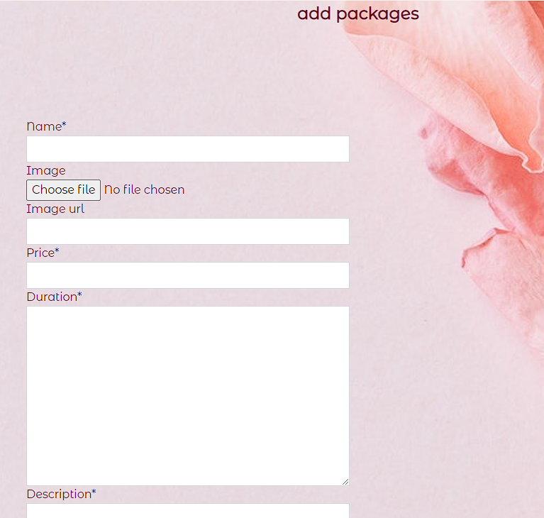

  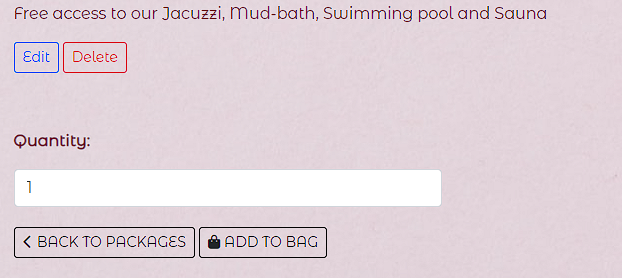

### Social Media

Creating a Facebook page was part of the business plan. Facebook is one of the largest social media platforms in the world. Having a page and posting regularly is a great way to engage with current and potential customers, as it allows you to target specific audiences and advertise to them in a cost-efficient way.

* FACEBOOK PAGE
  * All users can have access to the Facebook Page

  

### Favicon

A favicon was added the website to enable users to easily locate the website in the browser when multiple tabs are open.

### Code features

* Created in Django using Gitpod.
* Deployed in Heroku for online interaction.
* Used AWS to store media files.

### Features to be implemented

* Add images to the packages
* Add spa photos

## Wireframes

* Home

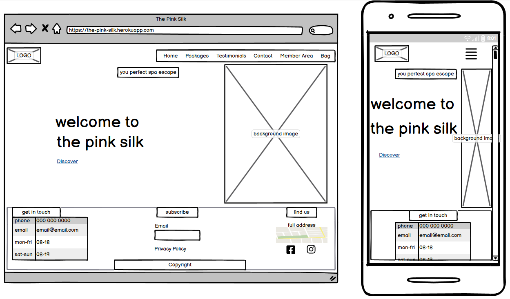

* Discover

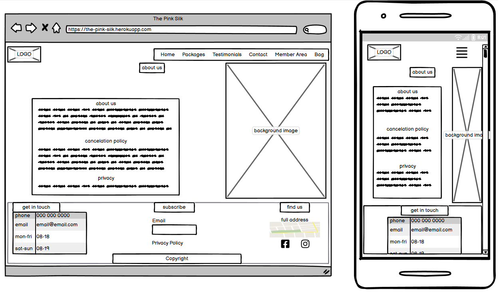

* Spa Packages - All

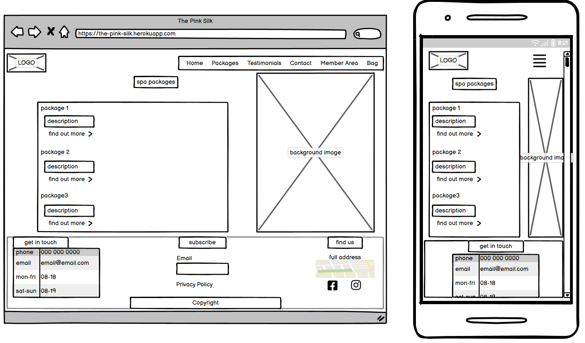

* Spa Packages - Detail

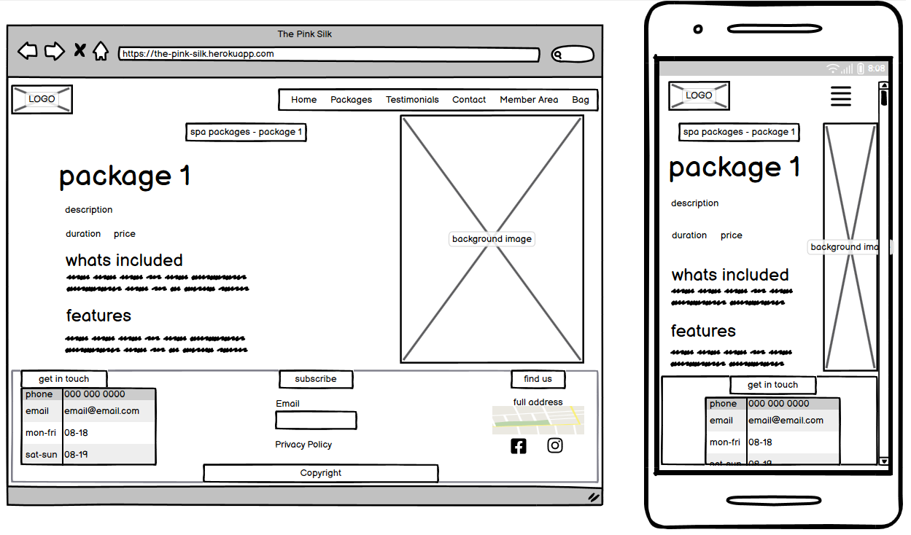

* Spa Packages - Add New

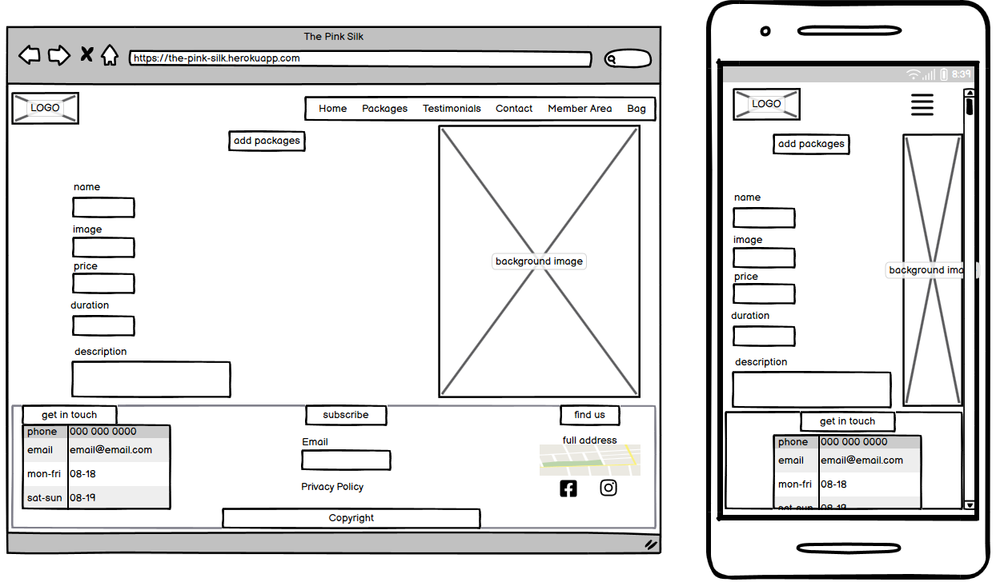

* Testimonial - All

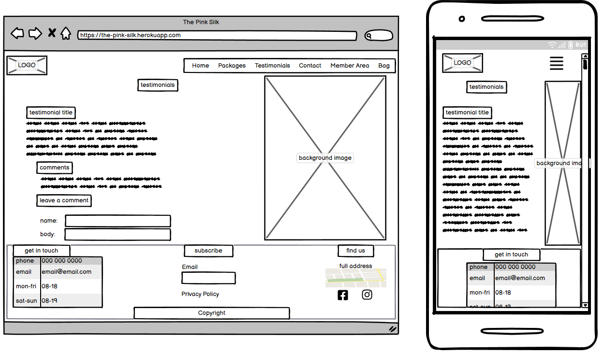

* Testimonial - Add New

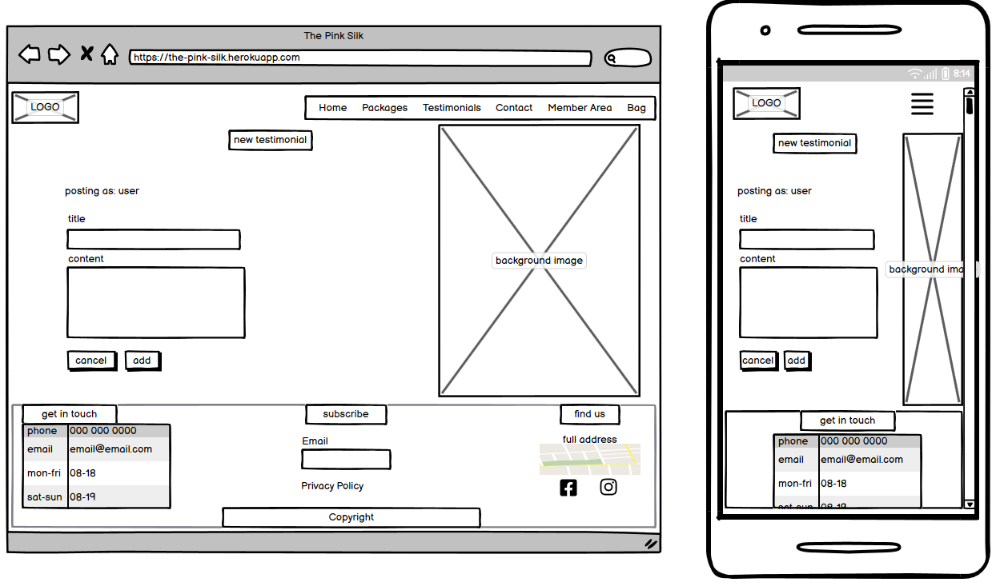

* Contact Us

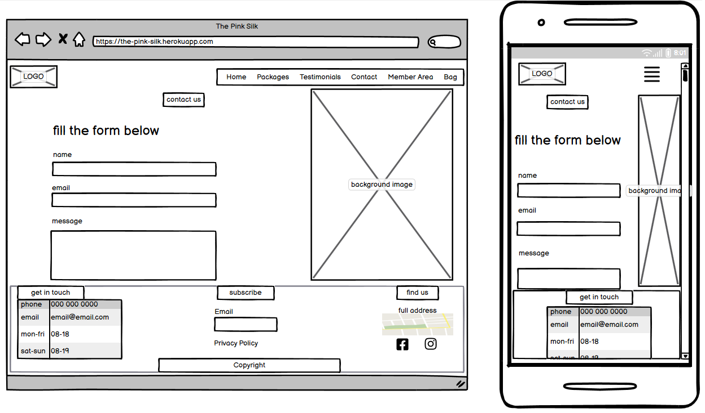

* Bag - Empty

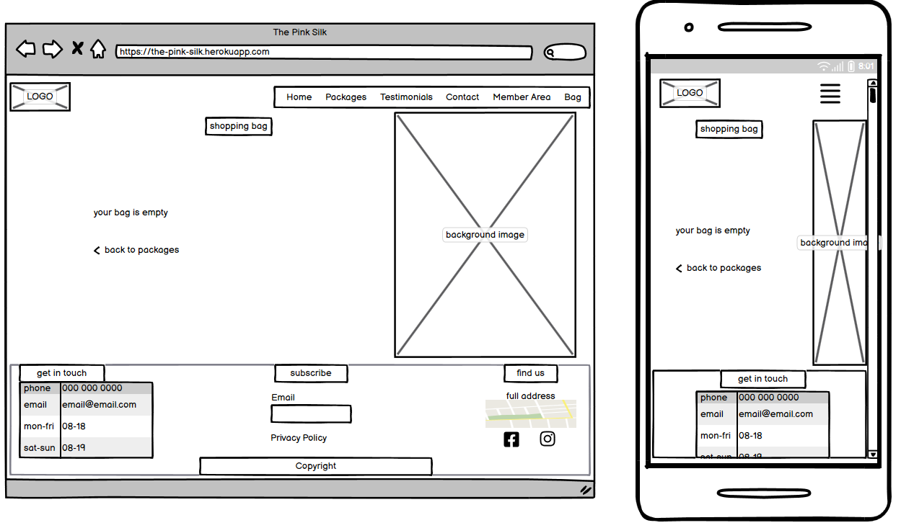

* Bag - Full

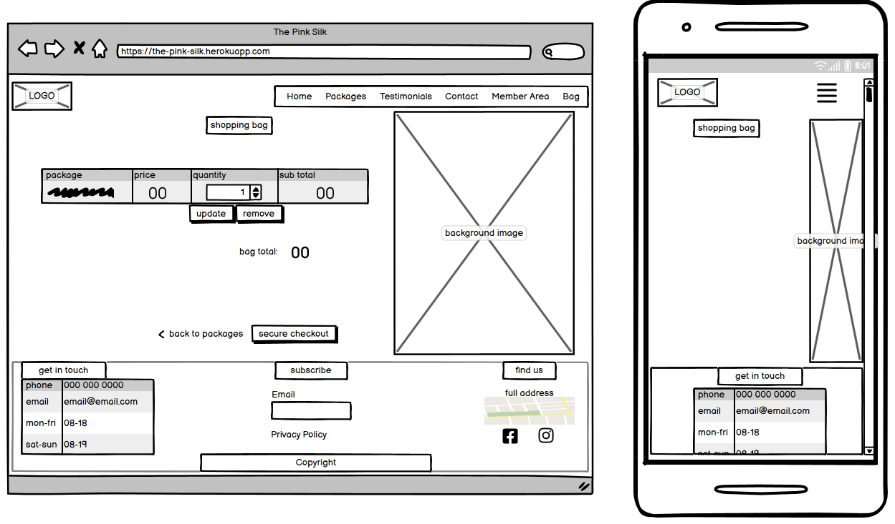

* Checkout

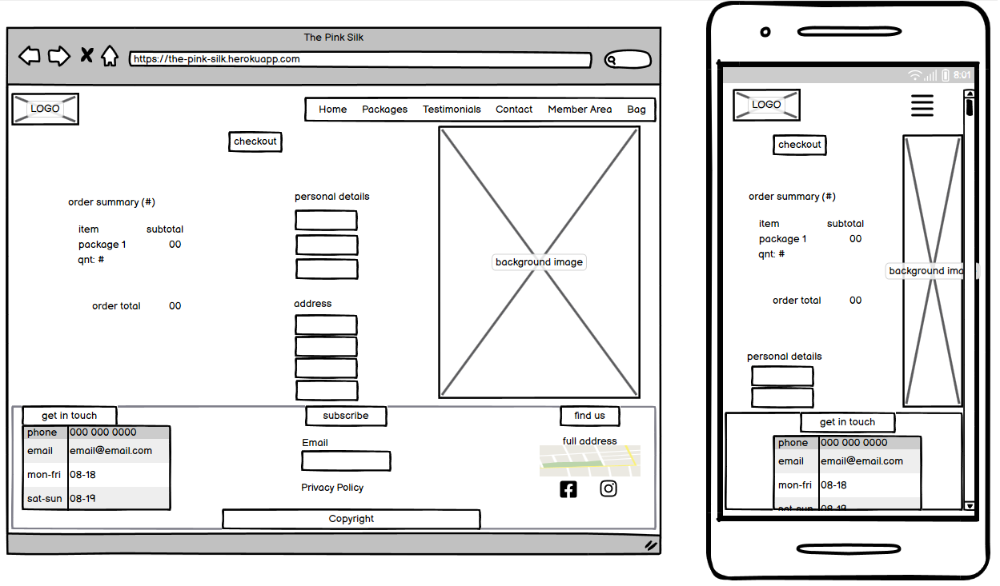

* Checkout Successful

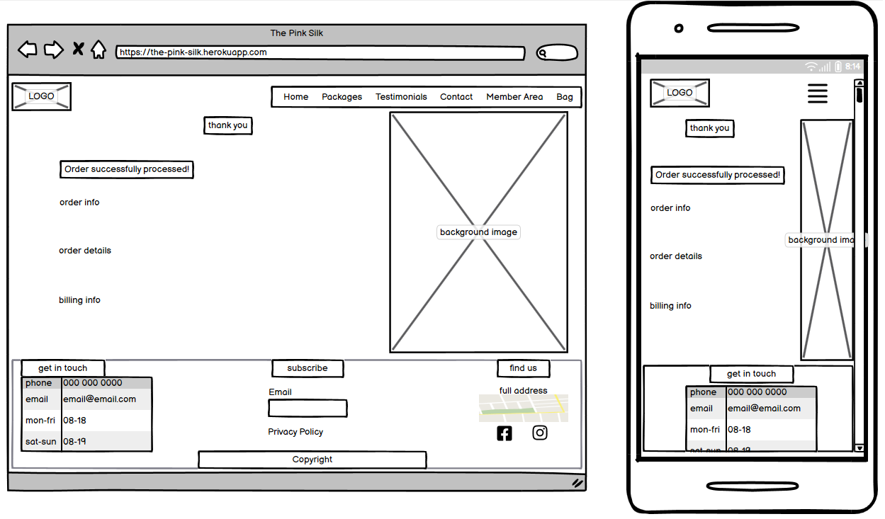

* My Profile

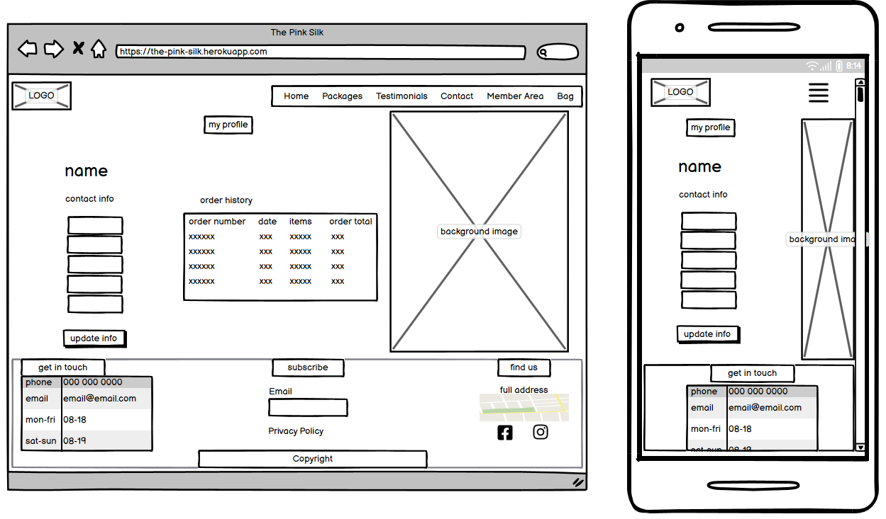

* Navbar - Admin

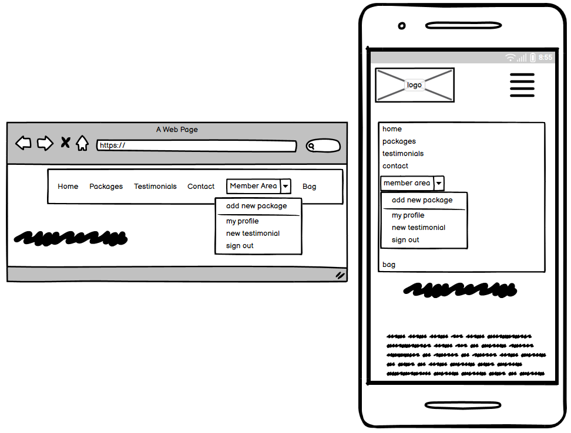

* Navbar - Registered User

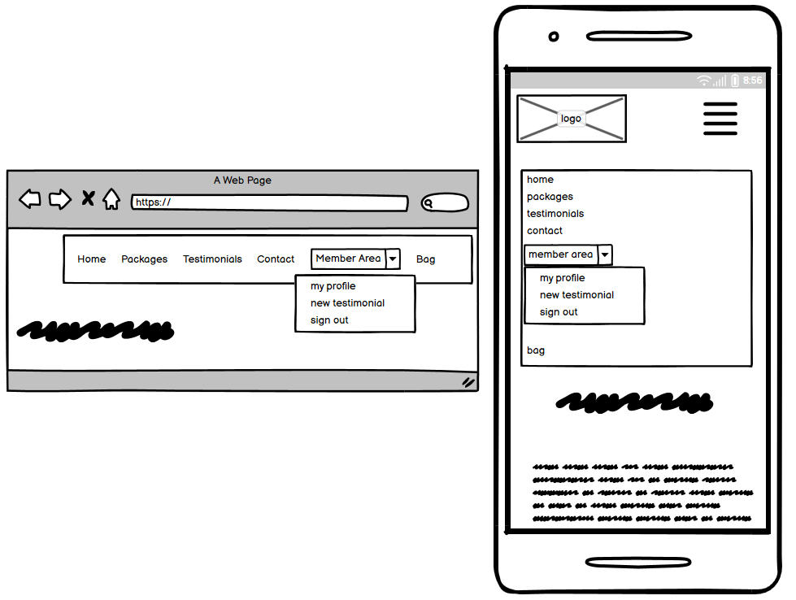

* Navbar - All Users

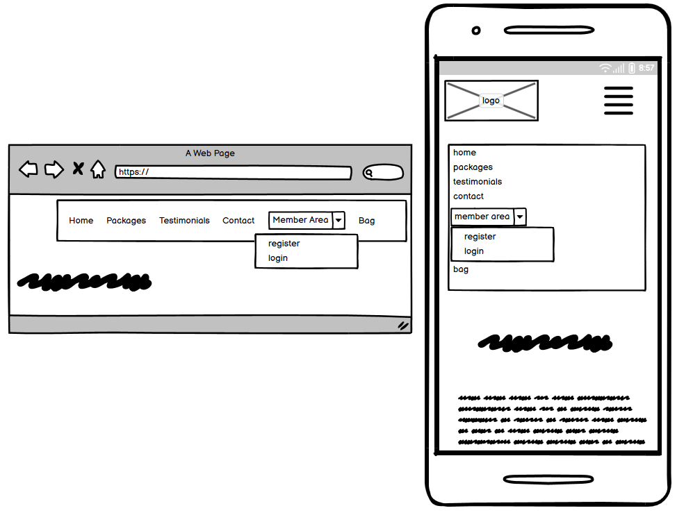

## Technologies used

### Languages

* [Python3](https://www.python.org/)
* HTML5
* CSS
* [JavaScript](https://www.javascript.com/)

### Frameworks, Libraries and other programs

* [Django](https://www.djangoproject.com/) framework (from Python)
* Django [Allauth](https://django-allauth.readthedocs.io/en/latest/installation.html) and [Crispy Forms](https://django-crispy-forms.readthedocs.io/en/latest/#) libraries
* [Gitpod](https://www.gitpod.io/) as IDE
* [GitHub](https://github.com/) to storage files
* [Bootstrap](https://getbootstrap.com/docs/5.2/getting-started/introduction/) for CSS package
* [Heroku](https://www.heroku.com) for deployment
* [ElephantSQL](https://www.elephantsql.com/) for database
* [Favicon](https://favicon.io/) for favicon
* [Pexels](https://www.pexels.com/) for images
* [AWS](https://aws.amazon.com/) for media storage
* [Mailchimp](https://mailchimp.com/) for email newslatter subscription

### Resources

* [Code Institute](https://codeinstitute.net/ie/) - course materials, Slack community and tutor/mentor support
* [Boostrap docs](https://getbootstrap.com/) - for material support
* [Django central](https://djangocentral.com/) - for inspiration and material support
* [Codemy.com](https://www.youtube.com/c/Codemycom) - youtube channel for material support
* [W3 Schools](https://www.w3schools.com/) - for material support

## Testing

### Manual Testing

* Manual tests done as admin user, regular user and visitant. In all scenarios the blog funcionalities worked without showing any issues.
* I also send the live link to friends and family members for testing and feedback.

Manual testing result:

### Code Testing

* Python - [PIP8](https://pep8ci.herokuapp.com/)

All .py files were individualy tested, with the exception of settings.py, as some of the lines are longer than 79 characters but they are required for functionality of the website.

* HTML - [W3C](https://validator.w3.org/nu/)

* CSS - [Jigsaw](https://jigsaw.w3.org/css-validator/)

* JavaScript - [JSHint](https://jshint.com/)

All .js files were individualy tested and passed in all the testes. You can check an exemple below.

### Accessibility Testing

* Tested using [Accessibility Test](https://accessibilitytest.org/).  You can check the full test result clicking [HERE](https://accessibilitytest.org/results/p8j650eYCBWt).

### Browser Testing

The site was tested and worked without any issues, using:
* Internet Explorer
* Google Chrome
* Microsoft Edge
* Firefox
* Samsung Internet

## Bugs/Issues

* Webhooks

    All the code seems correct. It was tested with the help of the Tutors and Mentor, however we could not find a solution for this error on time for the submission. 

## Deployment

### Requirements for Deployment

* Heroku account
* Stripe account
* ElephantSQL account
* GitHub account, Gitpod

### Heroku Deployment

This project was deployed on Heroku following these steps:

#### Requirements.txt and Procfile

Create these files using these steps in (GitPod) terminal:

1. Type `pip3 freeze -–local > requirements.txt` to create a requirements file (it keeps track of the Python / Django dependencies that we've installed for our project)
2. Type `echo web: python3 run.py > Procfile` to create Procfile (a Heroku-specific type of file that tells Heroku how to run our project, what command to use to start the app)
3. Delete any additional empty lines after the line `web: gunicorn pink_silk.wsgi:application`
4. Push these two files into your depository

#### Create Heroku App

1. Log in to Heroku and 'Create New App' from the dashboard
2. Give your app a name and select the region closest to you. When you’re done, click Create app to confirm
3. Add config vars to Heroku - go to Heroku Settings tab, click on Reveal Config Vars, and add environment variables described below in key/value pairs

   * DATABASE_URL - your database variable from ElephantSQL

   * SECRET_KEY - there are websites online that will help you generate random Django secret keys

   * EMAIL_HOST_USER - your email address used to send emails out

   * EMAIL_HOST_PASS - used to authenticate to the SMTP server

   * STRIPE_PUBLIC_KEY, STRIPE_SECRET_KEY, STRIPE_WH_SECRET - Stripe payments variables (you will need to set up a Stripe account)

   * USE_AWS - to upload images to AWS (you will need to set up an AWS account)

   * AWS_ACCESS_KEY_ID, AWS_SECRET_ACCESS_KEY - AWS storage variables

#### Create Database

1. Sign up for ElephantSQL.com to access your dashboard and click “Create New Instance”
2. Set up your plan, give it a name and select the Tiny Turtle (Free) plan
3. Click “Select Region”, select a data center near you and click "Review"
4. Check your details are correct and then click “Create instance”
5. Return to the ElephantSQL dashboard and click on the database instance name for this project
6. In the URL section, clicking the copy icon will copy the database URL to your clipboard
7. Open your Gitpod and, in the terminal, install dj_database_url and psycopg2, both of these are needed to connect to your external database
8. Update your requirements.txt file with the newly installed packages
9. In your settings.py file, import dj_database_url underneath the import for os
10. Comment out your current database and add the new ElephantSQL database
11. Migrate your database models to your new database and then load in the fixtures
12. Create a superuser for your new database
13. Delete the new database from your settings.py and uncomment your old database

#### Deploying our App to Heroku

1. Navigate to the Deploy tab in Heroku and connect your app to GitHub.
2. Deploy the branch manually.
3. Check the build log for errors.
4. Once Heroku completed the build process, you will see a 'Your App Was Successfully Deployed' message and a link to the live site.
5. You can also choose to enable Automatic deploys. 

#### Alternative Heroku deployment via CLI

0. In your CLI install Heroku by typing `npm install -g heroku`
1. Login to Heroku by typing `heroku login -i`
2. Get your app name from Heroku by typing command `heroku apps`
3. Set the Heroku remote (replace the <app_name> with your actual app name): `heroku git:remote -a <app_name>`
4. Add and commit changes to your code (commands `git add .` & `git commit -m "Deploy to Heroku via CLI"`)
5. Push to GitHub `git push origin main`
6. Push to Heroku `git push heroku main`
7. Your Heroku app will be built and you will see your deployed app's URL

## Credits

### Code

* Code based on and developed from Code Institute's walkthrough Boutique Ado.

### Content

* Background image from [Pexels](https://www.pexels.com/).
