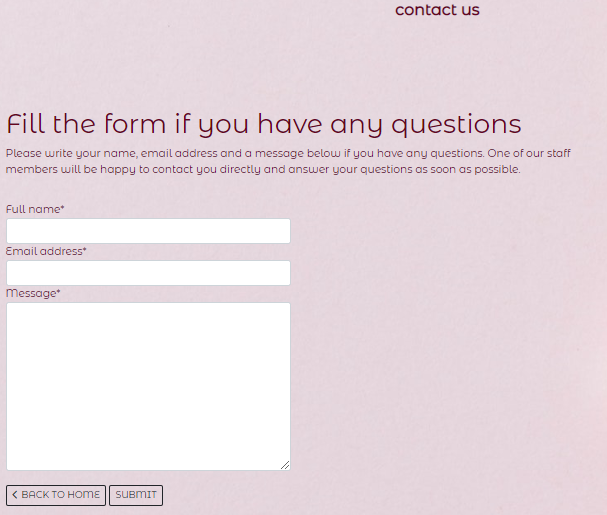

# THE PINK SILK

For my Project Portifolio #5 on Code Institute's Diploma in Software Developement course I have created an E-commerce store for a SPA called The Pink Silk. 

On the website, all users have access to view and purchase the available spa packages. Registered users can also have access at their profile page, where is possible to edit their personal information and view previous orders. Store management with a superuser access can add new packages for sale, as well as edit and delete existing packages.

You can check the store page clicking [HERE](https://the-pink-silk.herokuapp.com/)

## Features

### Code features

* Created in Django using Gitpod.
* Deployed in Heroku for online interaction.
* Used AWS to store media files.

### User features

* NAVBAR
  * Home - on the navigation bar at the top right, brings the user back to the home page.
  * Spa Packages - on the navigation bar at the top right, brings the user to a page containing a brief information about the available packages.
  * Testimonials - on the navigation bar at the top right, brings the user to a page where a list with all testimonials can be seen.
  * Contact - on the navigation bar at the top right, brings the user to a page containg a contact form.
  * Member Area - on the navigation bar at the top right:
    * All users have options to Register or Sign In
    * Registerd users have options to Sign Out, leave a New Testimonial or visit My Profile
    * Superusers have the same options as Registered users plus an option to Add New Package
  * Shopping Bag - on the navigation bar at the top right, brings the user to the shopping bag page.

  

* FOOTER
  * Get In Touch - column that provides the user the email and phone number of the Spa and also shows the openning times.
  * Subscribe - column where the user can subscribe for the Spa newsletter and also find a link to the Privacy Policy.
  * Find Us - column that shows the address and a map to the Spa location and also links to Social Media.
  
  

* DISCOVER
  * By clicking on the Discover button at the Home page, the user is redirected to a page containg more information about the Spa, such as Cancellation Policy, Privacy and Terms and Conditions.

  

  

* SHOPPING BAG
  * Where the user can see the packages seleted for purchase.
  * Is possible to adjust the quantity by typing a number in the box or using the arrows and then clicking on Update.
  * To remove thepackage from the bag, just click on the Remove buttom.
  * For purchase, click on Secure Checkout.
  * To add more items, click on Back to Packages.

  

* TESTIMONIALS
  * All users can read and leave comments on the testimonials.
  * Registered users can write new testimonials.

  

* CONTACT FORM
  * All users can file the contact form.

  

* FACEBOOK PAGE
  * All users can have access to the Facebook Page

  

## Technologies used

### Languages

* [Python3](https://www.python.org/)
* HTML5
* CSS
* [JavaScript](https://www.javascript.com/)

### Frameworks, Libraries and other programs

* [Django](https://www.djangoproject.com/) framework (from Python)
* Django [Allauth](https://django-allauth.readthedocs.io/en/latest/installation.html) and [Crispy Forms](https://django-crispy-forms.readthedocs.io/en/latest/#) libraries
* [Gitpod](https://www.gitpod.io/) as IDE
* [GitHub](https://github.com/) to storage files
* [Bootstrap](https://getbootstrap.com/docs/5.2/getting-started/introduction/) for CSS package
* [Heroku](https://www.heroku.com) for deployment
* [ElephantSQL](https://www.elephantsql.com/) for database
* [Favicon](https://favicon.io/) for favicon
* [Pexels](https://www.pexels.com/) for images
* [AWS](https://aws.amazon.com/) for media storage
* [Mailchimp](https://mailchimp.com/) for email newslatter subscription

## Resources

* [Code Institute](https://codeinstitute.net/ie/) - course materials, Slack community and tutor/mentor support
* [Boostrap docs](https://getbootstrap.com/) - for material support
* [Django central](https://djangocentral.com/) - for inspiration and material support
* [Codemy.com](https://www.youtube.com/c/Codemycom) - youtube channel for material support
* [W3 Schools](https://www.w3schools.com/) - for material support

## Credits

### Content

* Background image from [Pexels](https://www.pexels.com/).

## User Stories

### As Visitor:

* I want to see all packages available so I can decide what to buy.

  Option available at the navigation bar, Spa Packages.

* I want to see reviews so I can decide if this is the right place for me.

  Option available at the navigation bar, Testimonials.

* I want to contact the Spa so I can have my queries answered.

  Option available at the navigation bar, Contact.

  Email and telephone number also available at the footer in every page.

* I want to be able to register so I can have my own account.

  Option available at the navigation bar, Member Area - Register.

* i want to know more about the Spa and it's cancelation policy.

  Option available by clicking on Discover at the home page.

### As Registered User:

* I want to write a testimonial so other users and the admin can read my opnion.

  Option available at the navigation bar, Member Area - Testimonials.

* I want to be able to login/out with no issues so I can have access to my profile.

  Option available at the navigation bar, Member Area - Log In / Out.

* I want to have a personal profile so I can store my information and see previous orders made.

  Option available at the navigation bar, Member Area - My profile.

### As Admin:

* I want to add new packages for sale so I can increase the options available.

  Option available at Member Area - Add new package.

* I want to be able to edit existing packages so I can keep it updated. 
  
  Option available at every individual package page.

* I want to be able to delete existing packages so I can remove it if unavailable.

  Option available at every individual package page.
 

## Testing

### Manual Testing

* Manual tests done as admin user, regular user and visitant. In all scenarios the blog funcionalities worked without showing any issues.
* I also send the live link to friends and family members for testing and feedback.

Manual testing result:

### Code Testing

* Python - [PIP8](https://pep8ci.herokuapp.com/)

All .py files were individualy tested, with the exception of settings.py, as some of the lines are longer than 79 characters but they are required for functionality of the website.

* HTML - [W3C](https://validator.w3.org/nu/)

* CSS - [Jigsaw](https://jigsaw.w3.org/css-validator/)

* JavaScript - [JSHint](https://jshint.com/)

### Accessibility Testing

* Tested using [Accessibility Test](https://accessibilitytest.org/).  You can check the full test result clicking [HERE](https://accessibilitytest.org/results/p8j650eYCBWt).

### Browser Testing

The site was tested and worked without any issues, using:
* Internet Explorer
* Google Chrome
* Microsoft Edge
* Firefox
* Samsung Internet

## Bugs/Issues

* Webhooks

    All the code seems correct. It was tested with the help of the Tutors and Mentor, however we could not find a solution for this error on time for the submission. 

## Creating a Repository and Deploying

* To create a new repository:

Logged in my GitHub page and accessed Code Institute GitHub page. 

Selected python-essencials-template and clicked in Use This Template. 

Created a new repository from the one mentioned above and choose the option 'Gitpod'. Once the repository is open on Gitpod it is just start to code. I chose the option to save automatically. 

After every significant amount of coding is time for local commits: On Gitpot, go to Source Control, type in a message and click Commit. After a work day, the last local commit is done and then click in Push to commit all local commits to GitHub repository. 

* To Deploy:

The project was deployed using Heroku. The process is as follows:

Once you have signed up to Heroku, on the top right of the dashboard there is a button labelled 'New'. This will open a dropdown; please select 'Create new app'. On the next page you can choose your region and a name for the project. Then click 'Create app'.

On the next page there is a menu along the top. Navigate to 'Settings', where you will find the config vars. Scroll down to the section named 'Config vars' and click on the button labelled 'Reveal config vars'. Cloudinary and Postgres will both need config vars as per your own details. You will also need to set a secret key. Once the config vars are saved, back in Gitpod save them in an env.py file. Make sure to add env.py to your .gitignore list so that your config vars do not become publically available on Github.

If you scroll back to the top of the page you will find the 'Deploy' tab, which has multiple options for deployment. As I am using Github for this project, I selected it and a bar came up to search for the repo I wish to connect to.

Once you have connected, you have the option to deploy automatically (the app will update every time you push) or manually (update only when you choose). I chose automatic but you can do what suits you.

After the first push/update, your app will be ready to go!
